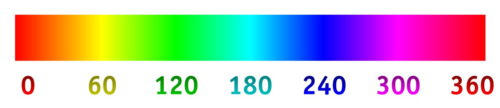
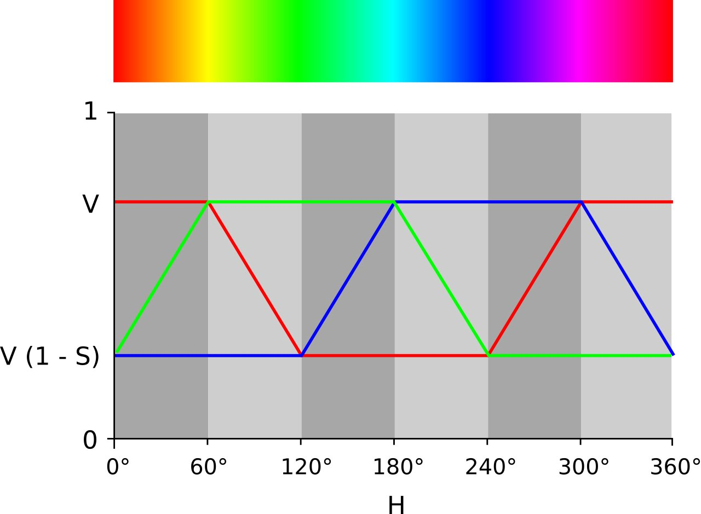

## 什么是颜色空间？

颜色空间是指用于描述和表示颜色的一组数学模型。在计算机视觉和图像处理中，常用的颜色空间包括RGB、HSV、YUV等。不同的颜色空间可以提供不同的信息，如颜色、亮度、色调等。

## RGB和HSV颜色空间

RGB颜色空间是指由红色、绿色和蓝色三个颜色通道组成的一种颜色模型。它是最常用的颜色空间之一，因为它非常直观和易于理解。但是，RGB颜色空间对光照和阴影非常敏感，因此在某些情况下可能不太适合图像处理。

HSV颜色空间是指由色调、饱和度和亮度三个通道组成的一种颜色模型。它可以更好地处理光照和阴影等问题。

- H表示色调（Hue），取值范围为[0, 360]，表示颜色的类型；
- S表示饱和度（Saturation），取值范围为[0, 1]，表示颜色的强度；
- V表示亮度（Value），取值范围为[0, 1]，表示颜色的亮度。

## OpenCV中的颜色空间转换

在OpenCV中，使用`cv2.cvtColor()`函数可以将图像从一个颜色空间转换到另一个颜色空间。下面是从RGB到HSV颜色空间的转换方法：

```python
import cv2

# 读取图像
img = cv2.imread('image.jpg')

# 将图像从RGB颜色空间转换到HSV颜色空间
img_hsv = cv2.cvtColor(img, cv2.COLOR_RGB2HSV)

```

`cv2.COLOR_RGB2HSV`是指从RGB颜色空间到HSV颜色空间的转换。

同样，还可以使用`cv2.COLOR_BGR2HSV`将图像从BGR颜色空间转换到HSV颜色空间。

## 附录
### Hue 色调（色相）

色相或色调（英语：hue）指的是色彩的外相，是在不同波长的光照射下，人眼所感觉不同的颜色，有红色、橙色、黄色、绿色、蓝色、紫色、粉红色、黑色、褐色、灰色、白色、金色和银色。

在HSL和HSV色彩空间中，H指的就是色相，是以红色为0度（360度）；黄色为60度；绿色为120度；青色为180度；蓝色为240度；洋红色为300度。



| 颜色名称 | 红绿蓝含量        | 角度   | 代表物体  |
|------|--------------|------|-------|
| 红色   | R255,G0,B0   | 0°   | 血液、草莓 |
| 橙色   | R255,G128,B0 | 30°  | 火、橙子  |
| 黄色   | R255,G255,B0 | 60°  | 香蕉、芒果 |
| 黄绿   | R128,G255,B0 | 90°  | 柠檬    |
| 绿色   | R0,G255,B0   | 120° | 草、树叶  |
| 青绿   | R0,G255,B128 | 150° | 军装    |
| 青色   | R0,G255,B255 | 180° | 水面、天空 |
| 靛蓝   | R0,G128,B255 | 210° | 水面、天空 |
| 蓝色   | R0,G0,B255   | 240° | 海、墨水  |
| 紫色   | R128,G0,B255 | 270° | 葡萄、茄子 |
| 洋红   | R255,G0,B255 | 300° | 火、桃子  |
| 桃色   | R255,G0,B128 | 330° | 墨水    |


**HSV和HSL色彩空间中最大饱和度颜色的色相和它们对应的RGB坐标之间的联系：**



### Saturation 饱和度

在HSV颜色空间中，饱和度是指一种颜色的纯度或强度。它是指色彩的强度或纯度，取决于颜色中白色的比例。饱和度值越高，颜色就越鲜艳，反之亦然。

饱和度是HSV中的一个重要特征，它可以用来描述图像中的颜色鲜艳程度。在图像处理中，我们可以利用饱和度的变化来调整图像的色彩效果。例如，我们可以通过增加饱和度来使图像的颜色更加鲜艳，或者通过降低饱和度来减少图像的色彩强度，使其更加自然。

### Value 亮度

V代表颜色的明度或亮度，是指颜色的明暗程度。在HSV颜色空间中，V的取值范围是0-100%，其中0%表示完全黑色，100%表示最大亮度或白色。

例如，我们可以通过修改图像的V值来调整图像的亮度和对比度。如果我们将某个图像的V值增加10%，则该图像的颜色会变得更加明亮，而如果将V值降低10%，则该图像的颜色会变得更加暗淡。