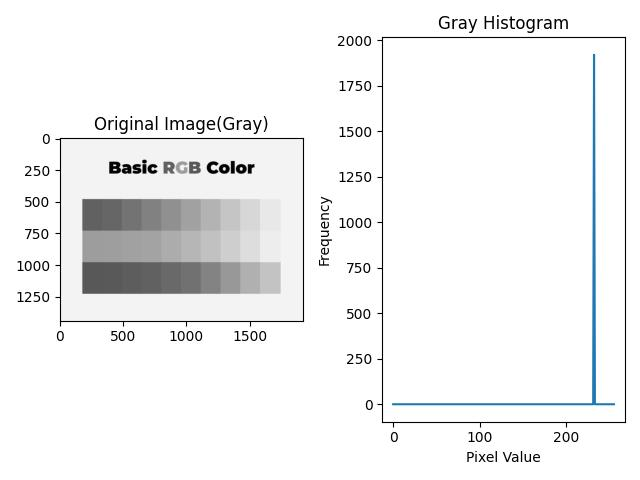
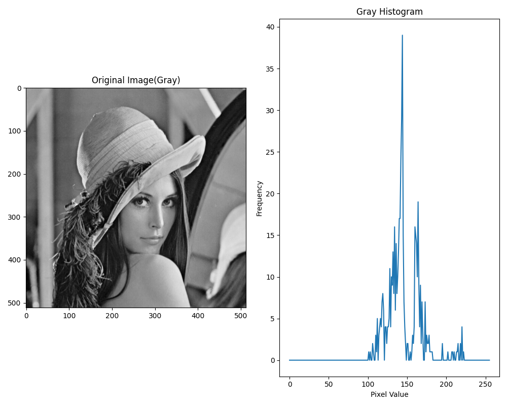
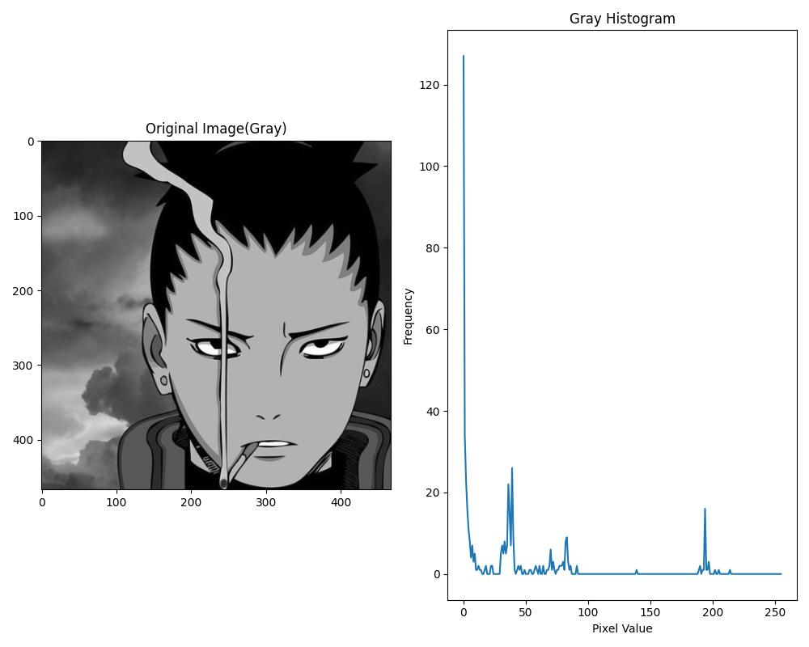
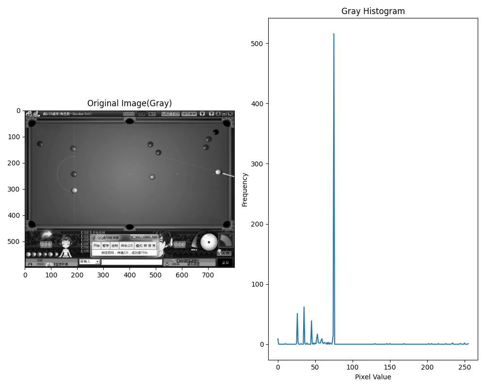
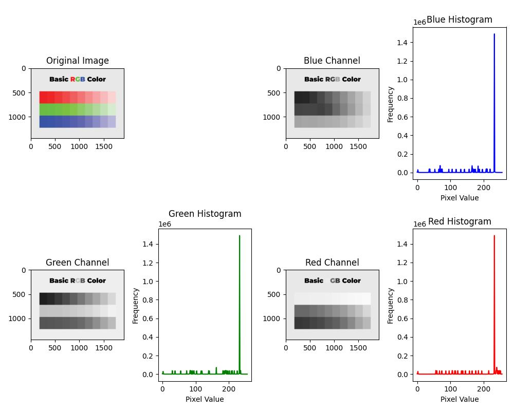
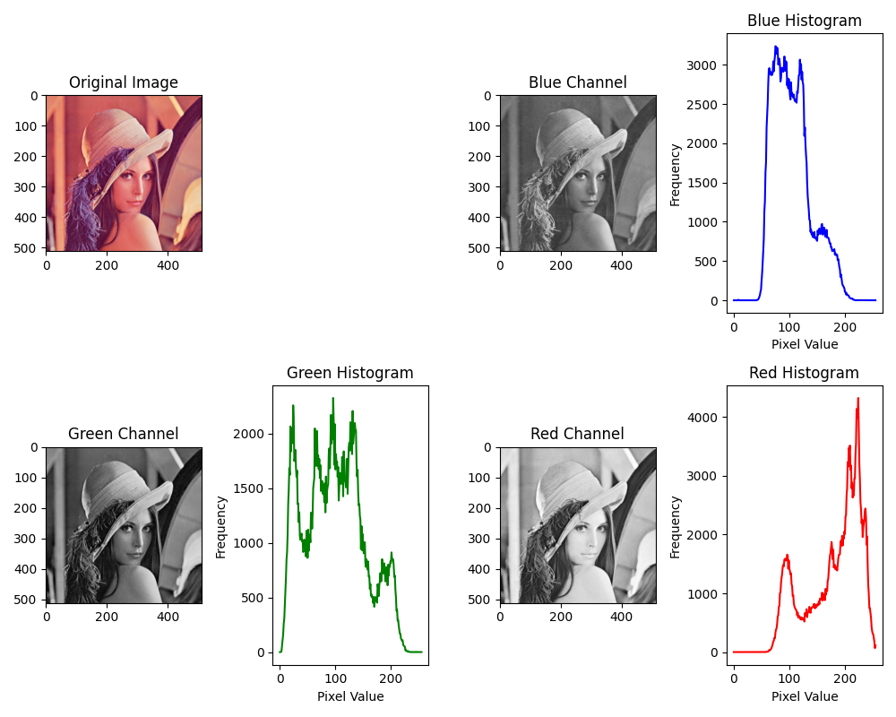
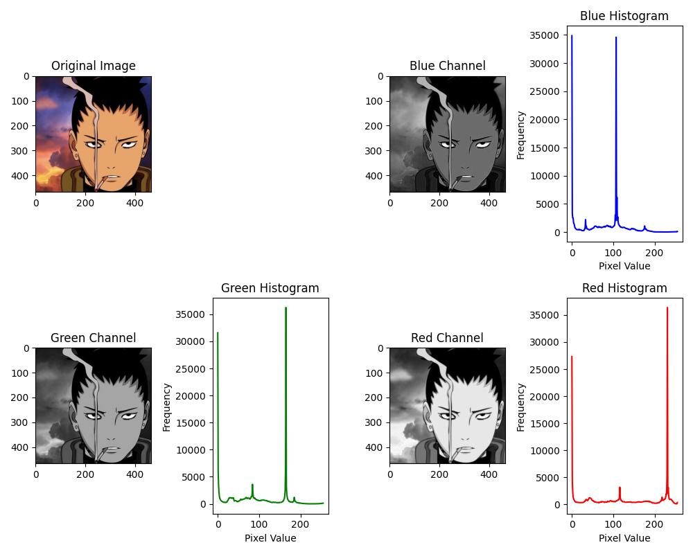
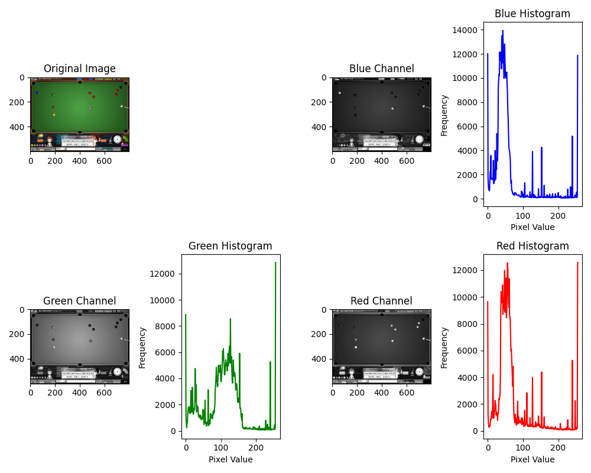

# 图像的计算直方图
图片的直方图用于分析图像中像素值的分布情况。

直方图可以帮助我们了解图像中各个亮度级别或颜色通道的像素数量，从而揭示图像的特征和信息。

- 对于灰度图像，直方图表示不同亮度级别的像素在图像中的分布情况。X轴表示像素的亮度级别，Y轴表示该亮度级别对应的像素数量。通过观察灰度图像的直方图，可以了解图像的对比度、亮度等信息。

- 对于彩色图像，可以分别绘制每个颜色通道（如红色、绿色、蓝色）的直方图。这有助于分析图像中不同颜色通道的分布情况，揭示图像的色彩特征。

通过分析直方图，可以判断图像是否过暗或过亮，是否存在高光或阴影区域，以及图像的整体亮度分布情况。在图像处理中，直方图均衡化是一种常用的方法，用于调整图像的亮度分布，增强图像的对比度。

## 例子： 
以灰度图像为例：

假设我们有一张表示山脉景色的灰度图像。这张图像中有大片的山地和天空区域。通过绘制图像的灰度直方图，我们可以得到以下信息：

- 亮度分布： 直方图的形状可以显示图像中亮度级别的分布。如果直方图在较暗的区域有较高的峰值，说明图像中存在许多阴影或暗部细节，可能是山脉的阴影部分。相反，如果直方图在较亮的区域有较高的峰值，可能是天空的高亮部分。

- 对比度： 直方图的分布范围可以显示图像的对比度。如果直方图分布范围很大，意味着图像中存在大量亮度差异，即使在同一图像中山地和天空的亮度差异也很大。

- 主体与背景分离： 如果直方图在某一区域有明显的峰值，而在其他区域很低，这可能表示主体（山脉）和背景（天空）之间的明显亮度差异。

- 细节和阴影： 直方图的形状可以提供关于图像中存在的细节和阴影的信息。峰值和波峰的位置可以告诉我们图像中的哪些区域具有更多的细节或阴影。

通过观察直方图，我们可以对图像的亮度分布、对比度、主体与背景分离以及细节和阴影等特征进行初步的分析。这有助于我们更好地了解图像的内容和特性，从而进行进一步的图像处理或分析。

## 灰度直方图

## 彩色直方图

